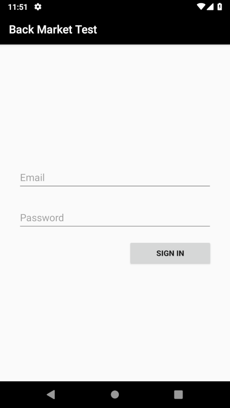
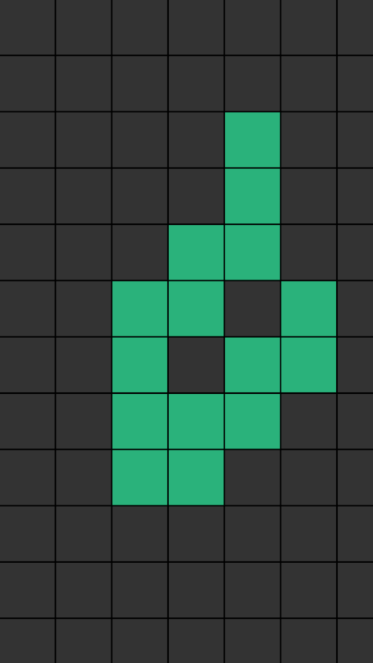

# Test technique mobile Back Market

Tout d'abord merci d'accorder votre temps à la réalisation de ce test technique.
Ce test est asynchrone sera sujet à un retour de la part de l'équipe tech mobile.

Donnez-le maximum et le meilleur de vous-même, comme si vous développiez votre app dans le meilleur des mondes (reconditionné cela s'entend ♻️).

## 📲 Synopsis 

Le test consiste en la création d'une application **modulaire** :

- L'application comportera les fonctionnalités suivantes :
	- **feature 1:**  Formulaire de saisie de mail.
	- **feature 2:**  Diagnostic de l'appareil + envoi du rapport.

- Il est demandé d'écrire :
	- Des tests unitaires sur la partie formulaire.
	- **Bonus**: un test UI du même écran.

Chez BackMarket nous aimons la créativité et le fun, toute expérience nouvelle ou enrichie sera la bienvenue !

## 🤓 Guidelines et attentes, à lire attentivement 

### Code & architecture

- Nous vous demandons de **structurer votre application en modules ou frameworks**, permettant de séparer les différentes features. Nous serons attentifs quant à la séparation des intelligences et à cette architecture.
- L'utilisation de librairies tierces est autorisée : indiquez-nous pourquoi vous en faites usage dans vos projets, ses avantages, impacts, etc. Montrez surtout ce que vous savez faire 😊
- **Votre manière de développer, coder une application et de gérer les ressources doit se refléter un maximum**, c'est un peu votre bébé. Votre code est soumis à une PR à la fin, vivez ce test en mode équipe !
- Concentrez-vous sur une UI smartphone (tablette est un bonus). Montrez comment vous développez vos vues, in-code / Storyboard / Xib, n'hésitez pas à partager votre point de vue dans la zone de commentaires.

### Expérience produit

- Nous attacherons une importance sur la **gestion des erreurs** et la **contextualisation des permissions** (vous êtes libres).
- Nous vous demandons de respecter l'UX des maquettes présentées. Vous êtes ensuite libres sur l'UI (animations, composants, etc.), **toute amélioration sera appréciée**, tant que le branding Back Market est bien entendu respecté 😉 (inspirez-vous de l'app sur le store).
- À ce propos, voici les différents codes couleurs :
	- Purple: `#D6B6FF`
	- Green: `#78E5A9`
	- Yellow: `#FFEE76`
	- Blue: `#A9F7ED`
	- Red: `#FB6D72`

### Commentez votre travail

- Nous ne sommes pas devins et le code peut avoir besoin de justifications, commentez ce qui est nécessaire.
- Soumettez vos développements régulièrement et d'une manière structurée sur le dépôt GitHub (même si le code a évolué et que ça ne vous plaisait pas!), GitFlow est votre ami 🤗.
- Commentez vos choix de manière plus globale via la zone de commentaire à la fin de ce ReadMe, ou via une Merge Request directement sur GitLab qui serait également apréciable (`develop` => `master`, `master` est protégée par défaut sur GitLab).

## 👨‍💻 Pré-requis techniques

- **IDE:** Xcode 11.3.1+ / Android Studio 3.5+
- **Langage:** Swift 5.1 / Kotlin 1.3+
- **Min API**: iOS 12 / Android 5 (API 21)
- **Target API**: la plus récente

## 📝 Feature 1 : Ecran de connexion


### Description du use-case attendu

Sur cet écran, l'utilisateur doit être capable de rentrer son adresse mail ainsi que sont mot de passe dans deux champs distincts.
Le champ de l'adresse mail doit être validé en temps réel pendant la saisie : vous êtes libre sur l'apparence UI quand le format n'est pas bon.

Un bouton "se connecter" vérifie que le formulaire est bien valide. Si la saisie n'est pas correcte, le(s) champ(s) de saisie devien(nen)t rouge(s) et un message apparait. La saisie est correcte si le mot de passe est strictement égal à "**iamabackmaker**".

Si la saisie est correcte, l'utilisateur est redirigé vers l'écran de la seconde feature.

Nous serons attentifs aux performances et à l'expérience de saisie.

### Screenshot

<p align="center" ></p>

## Feature 2 : Diagnostic de l'appareil

### Introduction

Pour cette partie, nous vous demandons le développement **du test de l'écran tactile de l'appareil**.

Le diagnostic consiste à afficher plusieurs vues permettant de réaliser un test spécifique sur l'appareil, l'idée est de se concentrer sur un des tests.

Une fois le diagnostic terminé, un rapport est généré et envoyé à un serveur distant via une API.

Visuellement, vous pouvez vous inspirer de notre app si vous le souhaitez, et toute personnalisation est la bienvenue.

### ☝️ Test de l'écran tactile

#### Description du use-case attendu

Avec son doigt, l'utilisateur doit survoler les cellules d'une grille pré-définie.
Le test prend fin une fois que toutes les cellules sont activées.
Le nombre de cellules n'est pas fixe et doit varier selon les tailles d'écran de sorte à occuper un maximum d'espace à l'écran (de sorte à pouvoir tester l'entièreté de l'écran).


Une cellule devient "remplie" lorsque l'utilisateur fait glisser son doigt sur celle-ci. **Un simple tap ne doit pas suffire.**
Quand une zone a été testée, elle change de couleur (elle peut être random). Ce changement de couleur **devra être animé** (soyez inventif 😉).

À l'arrivée sur l'écran de diagnostic, un message s'affiche expliquant à l'utilisateur ce qu'il doit faire pour réussir le test.
Lorsque 3 zones ont été testées, le message disparait.
L'apparition et la disparition du message **devront être animées**


#### Wireframe

<p align="center"> </p>


## 🛫 Envoi du diagnostic

Une fois le diagnostic terminé, un rapport est généré et envoyé à un serveur distant via une API. Ce rapport contient des infos générique du modèle de l'appareil, du temps que le diagnostic à duré, ainsi que les infos du test réalisé.

Cette API n'existant pas, vous devrez faire en sorte de mocker / simuler la partie communication avec le serveur.

Un système UI/UX de chargement devra être affiché le temps que le serveur traite la réponse. À vous de choisir la meilleure expérience.

Une fois la réponse reçue, l'utilisateur est redirigé vers le 1er écran.

### Format du JSON à envoyer

Voici le format de JSON attendu :

```json5
{
	//Données du 1er test, null si non réalisé
	"deviceInfos": {
		//Nom de l'appareil sur lequel le test s'est déroulé
		"modelName":"iPhone 11,2"
	},
	//Données du 3e test, null si non réalisé
	"screenTouchTest": {
		//Nombre de colonnes affichées
		"nbColumns":7,
		//Nombre de lignes affichées
		"nbRows":12,
		//Nombre de cellules remplies
		"nbCellslFilled":84
	},
	//Timestamp du début du test
	"startTime":"2018-10-23T18:25:42.000Z",
	//Timestamp de la fin du test
	"endTime:":"2018-10-23T18:26:43.000Z"
}
```

## 🗣 Commentaires

Exprimez-vos choix (ici ou via la Merge Request via GitLab) sur :

- les choix d'architecture 
- les choix techniques sur lesquels vous voulez vous expliquer / justifier ;
- les librairies tierces choisies ;
- les design patterns employés ;
- les difficultés rencontrées.
